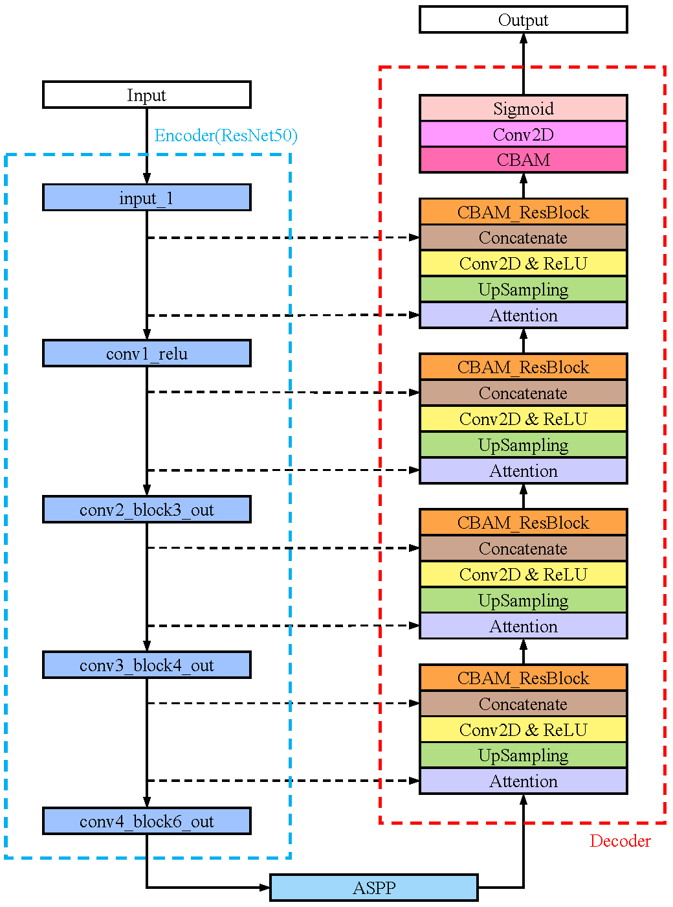

# Residual U-Net with Attention Mechanisms

Medical Image Segmentation using Residual U-Net with Attention Mechanisms.

The network takes advantage of [Residual Blocks](https://arxiv.org/pdf/1603.05027v3.pdf), [Atrous Spatial Pyramid Pooling](https://arxiv.org/pdf/1706.05587.pdf), and [Convolutional Block Attention Module](https://arxiv.org/pdf/1807.06521.pdf). We replace all pooling operations with [convolutional layers with strides of 2](https://arxiv.org/pdf/1412.6806.pdf), and `Conv2DTranspose` is substituted with nearest-neighbor `UpSampling` followed by Conv2D & ReLU to dampen [checkerboard artifacts](https://distill.pub/2016/deconv-checkerboard/).

## Network architecture

    

<h6 align="center">Block diagram</h6>

    

<h6 align="center">3D architecture</h6>

## Datasets

The following publicly available datasets are used in the experiments:

| Dataset                                                      | Number of mages | Image shape ($w \times h$) |
| ------------------------------------------------------------ | --------------- | -------------------------- |
| [CVC-ClinicDB](https://polyp.grand-challenge.org/CVCClinicDB/) | 612             | $384 \times 288$           |
| [CVC-ColonDB](https://drive.google.com/file/d/1S0GvCLOoSiePEiJJkX3r-RCd34PHFyQF/view?usp=sharing) | 380             | $574 \times 500$           |
| [ETIS-LaribPolypDB](https://polyp.grand-challenge.org/EtisLarib/) | 196             | $1225 \times 966$          |
| [Kvasir-SEG](https://datasets.simula.no/kvasir-seg/)         | 1000            | Variable                   |

## Image preprocessing

The following transformations are done with the help of [albumentations](https://github.com/albumentations-team/albumentations):

- Crop, flip, rotate, transpose
- Random brightness contrast
- Random Gamma
- Hue Saturation Value (HSV)
- Contrast Limited Adaptive Histogram Equalization (CLAHE)
- Blur (motion blur, median blur, Gaussian blur)
- Gauss noise
- RGB shift
- Channel shuffle
- Coarse dropout
- ...

After these operations, the number of training samples increased by 25 times.

For simplicity, we resize all images to a fixed size of $256 \times 256$ in accordance with the model input shape.

## Hyperparameters

- Bacth size: 8
- Epochs: 250
- Initial learning rate: 1e-3
- Optimizer: Nadam
- Loss: Dice loss

## Configurations for CUDA and cuDNN

- Compatible versions of tensorflow-gpu, python, CUDA, and cuDNN: [Tested build configurations](https://tensorflow.google.cn/install/source_windows#gpu)
- CUDA Toolkit and corresponding driver versions: [NVIDIA CUDA Toolkit Release Notes](https://docs.nvidia.com/cuda/cuda-toolkit-release-notes/index.html#abstract)
- Driver download: [NVIDIA Driver Downloads](http://www.nvidia.com/drivers)
- CUDA download: [CUDA Toolkit Archive](https://developer.nvidia.com/cuda-toolkit-archive)
- cuDNN download: [cuDNN Archive](https://developer.nvidia.com/rdp/cudnn-archive)

The latest tensorflow-gpu solved [this bug](https://github.com/tensorflow/tensorflow/issues/46249), so I just switch to tf2.6 with CUDA 11.2 and cuDNN 8.1 installed.

