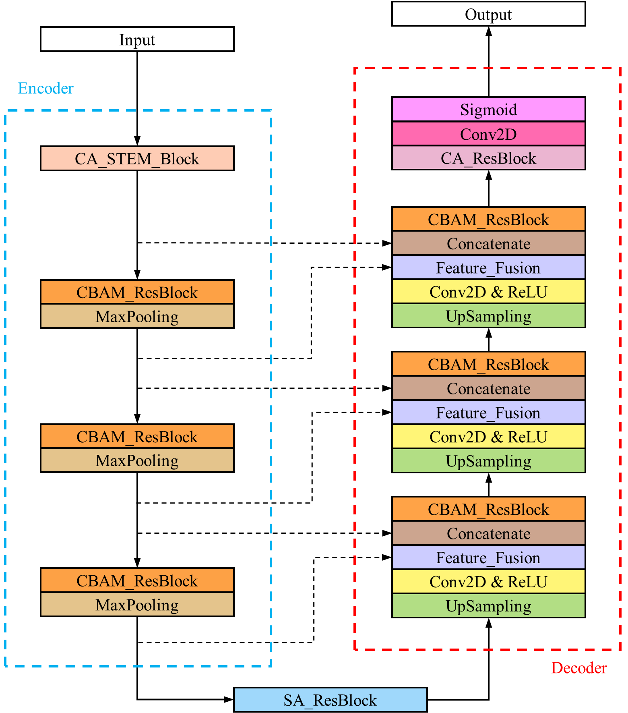
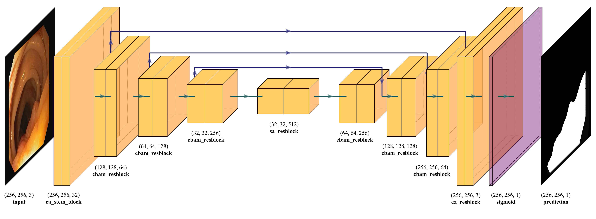

# Residual U-Net with Attention Mechanism

Medical Image Segmentation using Residual U-Net with Attention Mechanism.

The network takes advantage of residual blocks, atrous spatial pyramid pooling, and channel- and spatial-attention blocks. We take ResNet50 as backbone to facilitate the training process.

## Network architecture

    

<h6 align="center">Block diagram</h6>

    

<h6 align="center">3D architecture</h6>

## Datasets

The following datasets are used in the experiments:

<ul>
    <li><a href="https://polyp.grand-challenge.org/CVCClinicDB/">CVC-ClinicDB</a></li>
    <li><a href="http://mv.cvc.uab.es/projects/colon-qa/cvccolondb">CVC-ColonDB</a></li>
    <li><a href="https://polyp.grand-challenge.org/EtisLarib/">ETIS-Larib polyp DB</a></li>
    <li><a href="https://datasets.simula.no/kvasir-seg/">Kvasir-SEG</a></li>
</ul>

## Image preprocessing

The following transformations are done with the help of [albumentations](https://github.com/albumentations-team/albumentations):

- Crop, flip, rotate, transpose
- Random brightness contrast
- Random Gamma
- Hue Saturation Value (HSV)
- Contrast Limited Adaptive Histogram Equalization (CLAHE)
- Blur (motion blur, median blur, Gaussian blur)
- Gauss noise
- RGB shift
- Channel shuffle
- Coarse dropout
- ...

After these operations, the number of training samples increased by 25 times.

## Hyperparameters

- Bacth size: 16
- Epochs: 250
- Learning rate: 1e-5
- Optimizer: Nadam
- Loss: binary crossentropy

## Configurations for CUDA and cuDNN

- Compatible versions of tensorflow-gpu, python, CUDA, and cuDNN: [Tested build configurations](https://tensorflow.google.cn/install/source_windows#gpu)
- CUDA Toolkit and corresponding driver versions: [NVIDIA CUDA Toolkit Release Notes](https://docs.nvidia.com/cuda/cuda-toolkit-release-notes/index.html#abstract)
- Driver download: [NVIDIA Driver Downloads](http://www.nvidia.com/drivers)
- CUDA download: [CUDA Toolkit Archive](https://developer.nvidia.com/cuda-toolkit-archive)
- cuDNN download: [cuDNN Archive](https://developer.nvidia.com/rdp/cudnn-archive)

The latest tensorflow-gpu solved [this bug](https://github.com/tensorflow/tensorflow/issues/46249), so I just switch to tf2.6 with CUDA 11.2 and cuDNN 8.1 installed.

